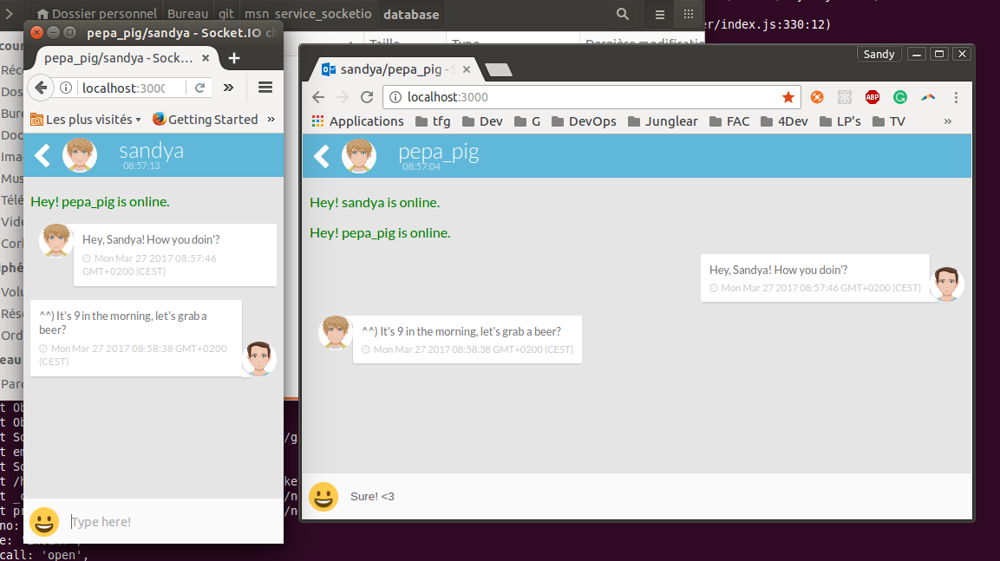

# Installation

- git clone https://github.com/sandycho/msn_service_nodejs.git
- cd /path/of/project
- npm install
- node server.js

# User guide

Enter your name(id) and the name(id) of the recipient user.
If there is a previous chat, the messages will be loaded.

If a new user in register it will be notify to all the users.

# Result

